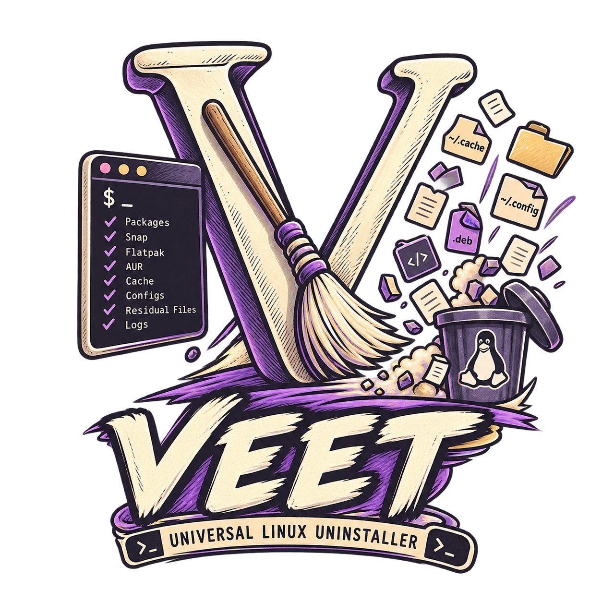
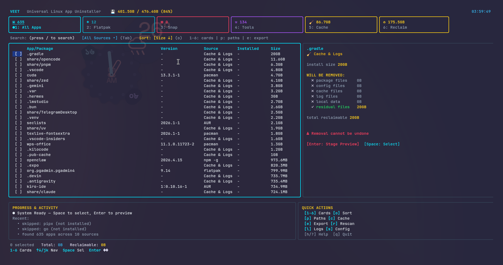

<div align="center">



# VEET

### Universal Linux Application Uninstaller &amp; Deep-Clean Residual Purger

[](https://github.com/swadhinbiswas/veet/actions/workflows/ci.yml)
[](https://aur.archlinux.org/packages/veet)
[](https://pkg.go.dev/github.com/swadhinbiswas/veet)
[](https://go.dev)
[](LICENSE)
[](#-technical-overview)
[](CONTRIBUTING.md)

<p align="center">
  <b>A modern, high-performance TUI and CLI uninstallation suite for Linux.</b><br/>
  <i>Scan 17+ package managers concurrently, detect hidden configurations &amp; cache bloat, inspect staged disk paths in real-time, and execute atomic uninstalls with single-pass privilege elevation.</i>
</p>

<p align="center">
  <a href="#-technical-overview">Overview</a> •
  <a href="#-comparison-matrix">Comparison</a> •
  <a href="#-core-capabilities">Capabilities</a> •
  <a href="#-installation">Installation</a> •
  <a href="#-usage">Usage</a> •
  <a href="#-search-syntax">Search Syntax</a> •
  <a href="#-theming">Themes</a> •
  <a href="#-keybinding-reference">Keybindings</a> •
  <a href="#-configuration">Config</a>
</p>

<br/>



</div>

---

## ⚡ Technical Overview

When software is uninstalled using conventional Linux package managers (`pacman -R`, `apt remove`, `dnf remove`, `flatpak uninstall`, `snap remove`), only package-managed system files (`/usr/bin`, `/usr/share`) are modified. User-space and container storage directories remain orphaned on disk:

- `~/.config/<app>` *(user configuration state &amp; credentials)*
- `~/.cache/<app>` *(accumulated runtime caches, shader caches, webview stores)*
- `~/.local/share/<app>` *(local databases, media, and state)*
- `~/.local/state/<app>` *(session histories and temporary state)*
- `~/.var/app/<app>` *(Flatpak sandboxed data)*
- `~/snap/<app>` *(Snap snapshots and application state)*
- `/var/log/<app>` and systemd journal archives

Over time, unmanaged leftovers consume gigabytes of valuable storage. Modern Linux setups also suffer from package fragmentation across native repositories, universal containers, and developer toolchains.

**VEET** bridges this gap: it scans all installed targets across **17+ package managers concurrently**, stages candidate residual paths for interactive inspection, and executes atomic uninstalls with batched, single-prompt privilege elevation.

---

## 📊 Comparison Matrix

| Feature | `pacman -R` / `apt` | `flatpak uninstall` | `bleachbit` | `veet` |
|:---|:---:|:---:|:---:|:---:|
| **Binary Removal** | Yes | Yes | No | **Yes (17+ Sources)** |
| **User Config Cleanup (`~/.config`)** | No | No | Partial | **Yes (Inspected &amp; Staged)** |
| **User Cache Cleanup (`~/.cache`)** | No | No | Yes | **Yes (Inspected &amp; Staged)** |
| **Sandbox Cleanup (`~/.var/app`, `~/snap`)** | No | Partial | No | **Yes (Deep detection)** |
| **Universal Multi-Source Aggregator** | No | No | No | **Yes (Native, Containers, CLI tools)** |
| **Orphaned Dependency Pruning** | Manual query | No | No | **Yes (Live detection)** |
| **Portable Binary Scanner (AppImage)** | No | No | No | **Yes (Auto-discovered)** |
| **Interactive Terminal UI (TUI)** | No | No | GTK Only | **Yes (7 Themes, Streaming Scan Matrix)** |
| **Advanced Query Syntax (`@source`, `>size`)** | No | No | No | **Yes (Full modifier support)** |
| **Pre-execution Dry-run Inspection** | Partial | Partial | Yes | **Yes (Full path inspection &amp; `--dry-run`)** |
| **Batched Sudo Elevation** | Per command | N/A | Full root required | **Yes (Single prompt per batch)** |

---

## 🌟 Core Capabilities

<table>
  <tr>
    <td width="50%" valign="top">
      <h4> 17+ Package Detectors</h4>
      <p>Concurrently queries system package managers (<code>pacman</code>/AUR, <code>apt</code>, <code>dnf</code>, <code>zypper</code>), sandboxed containers (<code>Flatpak</code>, <code>Snap</code>), portable bundles (<code>AppImage</code>, <code>Homebrew</code>, <code>Nix</code>), and language toolchains (<code>npm -g</code>, <code>pipx</code>, <code>cargo</code>, <code>gem</code>, <code>go install</code>) with zero-cost skipping for uninstalled tools.</p>
    </td>
    <td width="50%" valign="top">
      <h4> Deep Residual Cleanup</h4>
      <p>Automates residual discovery across user configurations, cached runtime stores (<code>~/.var/app</code>, <code>~/snap</code>, <code>~/.local</code>), desktop integration entries, icons, and system paths, staging each candidate before execution.</p>
    </td>
  </tr>
  <tr>
    <td width="50%" valign="top">
      <h4> Streaming Scan Matrix</h4>
      <p>Live, responsive startup matrix displaying real-time progress across all 17 detectors with color-coded status tiles, animated progress bar, package counters, live elapsed timer, and background discovery feed.</p>
    </td>
    <td width="50%" valign="top">
      <h4> Orphan &amp; Dependency Pruning</h4>
      <p>Live detection and safe reclamation of unneeded dependency packages across native package managers (<code>pacman -Qdt</code>, <code>apt autoremove</code>, <code>dnf repoquery --unneeded</code>).</p>
    </td>
  </tr>
  <tr>
    <td width="50%" valign="top">
      <h4> System Log &amp; Journal Vacuum</h4>
      <p>Identifies bloated systemd journal storage and cleans it safely via <code>journalctl --vacuum</code> alongside rotated compressed log archives with integrated elevated vacuum routines.</p>
    </td>
    <td width="50%" valign="top">
      <h4> Anti-Brick Safety &amp; Sudo Batching</h4>
      <p>Core system components (<code>glibc</code>, <code>linux</code>, <code>systemd</code>, active shell) are protected from selection. System paths are batched into a single elevated transaction.</p>
    </td>
  </tr>
</table>

---

## 📥 Installation

### Option 1: Arch Linux (AUR)

Install via your preferred AUR helper:

```bash
yay -S veet
# or
paru -S veet
```

*For the latest development git build:*
```bash
yay -S veet-git
```

---

### Option 2: Automated Script Installation (Recommended)

Downloads, compiles with binary optimizations (`-ldflags="-s -w"`), installs to `~/.local/bin/veet`, and configures shell autocompletions:

```bash
# Install latest release
curl -sSL https://raw.githubusercontent.com/swadhinbiswas/veet/main/install.sh | bash

# Or install a specific pinned release tag (e.g. v1.1.0)
curl -sSL https://raw.githubusercontent.com/swadhinbiswas/veet/v1.1.0/install.sh | VEET_VERSION=v1.1.0 bash
```

*Or from a local clone:*
```bash
./install.sh
```

---

### Option 3: Go Package Manager

Install directly via the standard Go toolchain (requires Go 1.24+):

```bash
go install github.com/swadhinbiswas/veet@latest
```

---

### Option 4: Manual Compilation via Makefile

```bash
git clone https://github.com/swadhinbiswas/veet.git
cd veet
make build
make install
```

> [!NOTE]
> Ensure `~/.local/bin` is present in your environment `$PATH`. If not, add `export PATH="$PATH:$HOME/.local/bin"` to your `~/.bashrc` or `~/.zshrc`.

---

## 🚀 Usage

### Interactive Terminal Dashboard (TUI)

Launch the full-featured interactive terminal user interface:

```bash
veet
```

---

### Headless Command Line Interface (CLI)

VEET exposes non-interactive headless subcommands for automation, scripting, and system auditing:

```bash
# Output installed application inventory table to stdout
veet scan

# Export machine-readable JSON inventory
veet scan --json

# Deep-clean uninstall one or multiple applications (interactive confirmation)
veet clean app1 app2

# Inspect staged paths without deleting anything
veet clean <package-name> --dry-run

# Non-interactive deep-clean removal with auto-confirmation
veet clean <package-name> --yes

# Detect and prune orphaned packages
veet orphans --clean --yes

# Inspect and purge leftover caches and directories
veet cache --clean --yes

# View or clear uninstallation audit history
veet history
veet history --clear
```

---

## 🔍 Search Syntax

Press <kbd>/</kbd> in the TUI to focus the search bar. VEET supports powerful query modifiers:

| Syntax | Example | Description |
|:---|:---|:---|
| `@<source>` | `@flatpak`, `@aur`, `@snap`, `@brew`, `@nix` | Filter by specific package manager |
| `><size>` | `>100M`, `>1G`, `>500K` | Filter applications larger than specified size |
| `<<size>` | `<50M`, `<10M` | Filter applications smaller than specified size |
| `protected:<bool>` | `protected:true`, `protected:false` | Filter by protected component status |
| `<name>` | `gimp`, `code`, `node` | Fuzzy-match application name |

> [!TIP]
> **Combine Modifiers**: `@flatpak >200M gimp` filters for Flatpak apps larger than 200MB matching "gimp".

---

## 🎨 Theming

VEET features **7 hand-crafted color palettes** to seamlessly integrate with your terminal setup. Configure your theme in `~/.config/veet/config.yaml`:

```yaml
theme: catppuccin  # Options: cyan, catppuccin, nord, dracula, gruvbox, tokyo-night, monokai
```

| Theme | Preview Description |
|:---|:---|
| **`cyan`** *(Default)* | High-contrast neon cyan &amp; indigo accents |
| **`catppuccin`** | Warm pastel Catppuccin Mocha palette with mauve highlights |
| **`nord`** | Clean arctic Nord blues with frost cyan accents |
| **`dracula`** | Iconic Dracula purple &amp; cyan palette |
| **`gruvbox`** | Earthy retro Gruvbox amber &amp; warm brown tones |
| **`tokyo-night`** | Sleek Tokyo Night deep navy &amp; vibrant cyan |
| **`monokai`** | Classic Monokai bright magenta &amp; green accents |

---

## ⌨️ Keybinding Reference

<table width="100%">
  <thead>
    <tr>
      <th width="25%">Keybinding</th>
      <th width="75%">Action</th>
    </tr>
  </thead>
  <tbody>
    <tr>
      <td><kbd>1</kbd> – <kbd>6</kbd></td>
      <td>Jump to stat card category (<code>All</code>, <code>Flatpak</code>, <code>Snap</code>, <code>Tools</code>, <code>Cache</code>, <code>Reclaim</code>)</td>
    </tr>
    <tr>
      <td><kbd>[</kbd> / <kbd>]</kbd> or <kbd>&larr;</kbd> / <kbd>&rarr;</kbd></td>
      <td>Cycle horizontally through top stat categories</td>
    </tr>
    <tr>
      <td><kbd>&uarr;</kbd> <kbd>&darr;</kbd> / <kbd>j</kbd> <kbd>k</kbd></td>
      <td>Navigate table selection cursor</td>
    </tr>
    <tr>
      <td><kbd>Space</kbd></td>
      <td>Toggle multi-select checkbox on active row</td>
    </tr>
    <tr>
      <td><kbd>d</kbd> / <kbd>D</kbd></td>
      <td><b>DELETE</b> highlighted app — opens <code>Really delete? [Y] Yes / [N] No</code> popup; <kbd>Y</kbd> uninstalls, <kbd>N</kbd>/<kbd>Esc</kbd> returns</td>
    </tr>
    <tr>
      <td><kbd>a</kbd></td>
      <td>Select / deselect all visible filtered rows (skips protected components)</td>
    </tr>
    <tr>
      <td><kbd>o</kbd> / <kbd>O</kbd></td>
      <td>Cycle sort order (<code>Size &darr;</code>, <code>Name A-Z</code>, <code>Source</code>, <code>Date &darr;</code>)</td>
    </tr>
    <tr>
      <td><kbd>p</kbd> / <kbd>P</kbd></td>
      <td>Toggle staged filesystem paths inspector in details panel</td>
    </tr>
    <tr>
      <td><kbd>/</kbd></td>
      <td>Focus advanced search input (supports <code>@source</code>, <code>>100M</code>, <code>protected:true</code>)</td>
    </tr>
    <tr>
      <td><kbd>Tab</kbd> / <kbd>Shift+Tab</kbd></td>
      <td>Cycle specific source filter dropdown (<code>pacman</code>, <code>aur</code>, <code>flatpak</code>, etc.)</td>
    </tr>
    <tr>
      <td><kbd>Enter</kbd></td>
      <td>Stage selected applications and open full confirmation preview modal (Enter again to confirm)</td>
    </tr>
    <tr>
      <td><kbd>c</kbd></td>
      <td>In History modal: clear audit log / In main table: quick purge for cache</td>
    </tr>
    <tr>
      <td><kbd>e</kbd></td>
      <td>Export audit inventory report to <code>~/.local/share/veet/apps-report.json</code></td>
    </tr>
    <tr>
      <td><kbd>r</kbd></td>
      <td>Trigger background rescan across all detectors</td>
    </tr>
    <tr>
      <td><kbd>l</kbd></td>
      <td>Open history audit log viewport</td>
    </tr>
    <tr>
      <td><kbd>s</kbd></td>
      <td>Open settings and protected components registry</td>
    </tr>
    <tr>
      <td><kbd>h</kbd> / <kbd>?</kbd></td>
      <td>Toggle keybinding reference overlay</td>
    </tr>
    <tr>
      <td><kbd>Esc</kbd></td>
      <td>Dismiss active modal / blur search input</td>
    </tr>
    <tr>
      <td><kbd>q</kbd> / <kbd>Ctrl+C</kbd></td>
      <td>Quit VEET</td>
    </tr>
  </tbody>
</table>

---

## ⚙️ Configuration

<details>
<summary><b>Custom Configuration (<code>~/.config/veet/config.yaml</code>)</b></summary>
<br/>

VEET supports optional user configuration via YAML. Create `~/.config/veet/config.yaml` to customize your visual palette, icon rendering mode, and register protected components:

```yaml
# Visual theme palette: cyan, catppuccin, nord, dracula, gruvbox, tokyo-night, monokai
theme: catppuccin

# Icon glyph set: auto (default), nerd, unicode, or ascii
# - auto: uses Nerd Fonts unless running in a raw Linux console (TTY) or dumb terminal
# - nerd: always use full Nerd Font symbols (e.g. 󰮯, , , )
# - unicode: standard universal Unicode symbols (e.g. ◎, ▲, ◆, ▣, ✓, ✗)
# - ascii: pure ASCII text labels with zero font requirements (e.g. [pac], [aur], [v], [x])
icons: auto

# Packages that VEET will refuse to stage or select for deletion
protected_packages:
  - custom-kernel-module
  - my-critical-service
  - proprietary-driver
```

</details>

<details>
<summary><b>System Architecture &amp; Module Map</b></summary>
<br/>

```text
veet/
├── main.go               # Cobra CLI entrypoint (scan, clean, orphans, cache, history, tui)
├── internal/
│   ├── model/            # Data types: AppInfo, RemovableFiles, Config, SourceMeta
│   ├── detector/         # Parallel detector engine (17+ source handlers)
│   ├── uninstaller/      # Staging engine, sudo batching & filesystem removal (Afero)
│   ├── history/          # Append-only audit logger (~/.local/share/veet/history.log)
│   └── ui/               # Bubble Tea & Lip Gloss TUI components with theme engine
├── aur/                  # Arch User Repository (AUR) PKGBUILD definitions
├── assets/               # Brand assets & custom vector icons
├── Makefile              # Build automation targets
├── install.sh            # Automated Bash installer
└── uninstall.sh          # Uninstaller script
```

</details>

---

## 🗑️ Uninstallation

### From Cloned Source Repository
```bash
./uninstall.sh
```

### Manual Removal (Binary &amp; Completions)
```bash
# Remove executable binary
rm -f ~/.local/bin/veet

# Remove shell autocompletions
rm -f ~/.local/share/bash-completion/completions/veet
rm -f ~/.local/share/zsh/site-functions/_veet
rm -f ~/.config/fish/completions/veet.fish

# Optionally remove audit logs and configurations
rm -rf ~/.local/share/veet ~/.config/veet
```

---

## 🤝 Contributing

Contributions are welcome! Please refer to [CONTRIBUTING.md](CONTRIBUTING.md) for local development setup, detector implementation guides, and testing protocols.

---

## 📄 License

VEET is open-source software licensed under the [MIT License](LICENSE).
